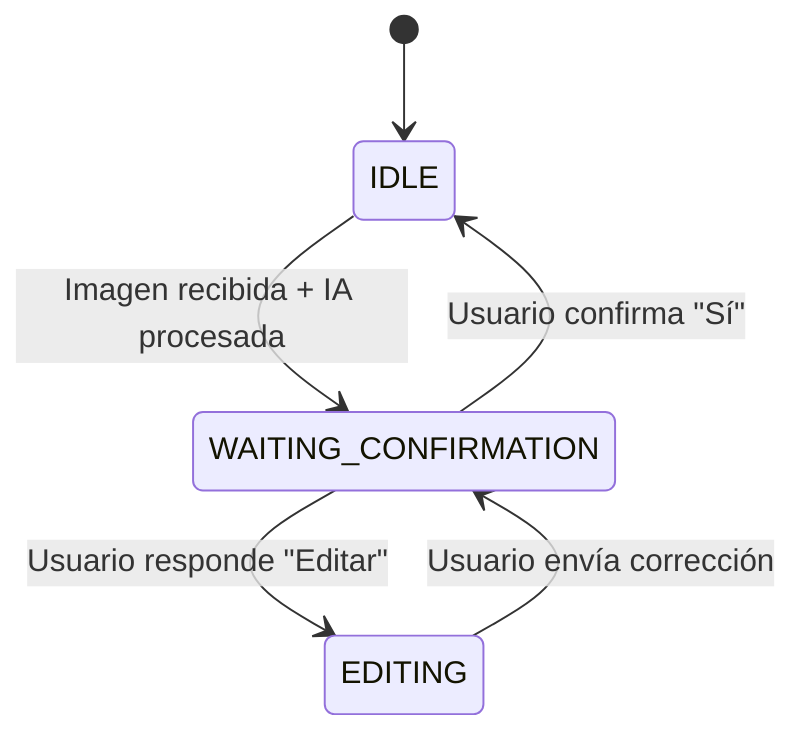

# PRD: Tikko - Sistema de Gestión de Gastos Empresariales

## 📋 Resumen Ejecutivo

**Nombre del Producto:** Tikko  
**Versión:** 1.0 (MVP)  
**Fecha:** Diciembre 2025  
**Última Actualización:** 18 de diciembre de 2025

### Visión del Producto

Tikko es una plataforma SaaS B2B que simplifica y automatiza la gestión de gastos empresariales mediante inteligencia artificial. Permite a freelancers y empresas cargar, procesar y analizar tickets de gastos de forma automática, utilizando IA para extraer datos de comprobantes y WhatsApp como canal de ingesta, eliminando la carga manual y acelerando los procesos de aprobación.

### Propuesta de Valor

- **Automatización con IA:** Extracción automática de datos de tickets mediante Gemini 2.5 Flash (comercio, fecha, monto, categoría, IVA)
- **Ingesta Multicanal:** Carga vía web, upload de imágenes o envío por WhatsApp
- **Análisis en Tiempo Real:** Dashboard con KPIs, rankings y tendencias de gastos
- **Colaboración Multi-tenant:** Soporte para múltiples organizaciones con roles y permisos
- **Escalabilidad:** Arquitectura serverless con Supabase Edge Functions

---

## 🎯 Objetivos del Producto

### Objetivos de Negocio

1. **Versión 1 (MVP Freelancers):** Resolver la gestión de gastos para profesionales independientes y pequeños equipos (1-5 usuarios)
2. **Versión 2 (Plan Empresa):** Escalar a organizaciones medianas con flujos de aprobación, roles y automatización completa
3. **Monetización:** Modelo SaaS con planes por usuario o volumen de tickets

### Objetivos de Usuario

- Reducir el tiempo de carga de gastos de minutos a segundos
- Eliminar errores de transcripción manual
- Acceder a análisis y reportes automáticos
- Simplificar aprobaciones y seguimiento de gastos

### Métricas de Éxito

- Tiempo promedio de carga de ticket < 10 segundos
- Precisión de extracción de IA > 90%
- Tasa de adopción de WhatsApp > 60%
- NPS > 40 en los primeros 3 meses

---

## 👥 Usuarios y Personas

### Persona Primaria: **Freelancer/Consultor**

- **Perfil:** Profesional independiente que necesita llevar registro de gastos para rendiciones o contabilidad
- **Necesidades:** Carga rápida, mínimo esfuerzo, acceso móvil
- **Pain Points:** Pérdida de tickets, carga manual tediosa, falta de visibilidad de gastos acumulados

### Persona Secundaria: **Administrador de Empresa**

- **Perfil:** Responsable de finanzas o RRHH en empresa mediana
- **Necesidades:** Control de gastos por colaborador, aprobaciones, reportes para contabilidad
- **Pain Points:** Procesos lentos, falta de transparencia, errores en cargas manuales

---

## 🚀 Funcionalidades Principales

### 1. Autenticación y Gestión de Cuenta

#### 1.1 Registro de Usuario

- **Métodos soportados:**
  - Email + contraseña
  - Google OAuth
  - Magic Link por email (sin contraseña)
- **Onboarding automático:**
  - Al registrarse, se crea automáticamente una "Organización Personal" con el usuario como `owner`
  - Redirección a dashboard tras completar registro

#### 1.2 Gestión de Sesión

- Sesión persistente con tokens de Supabase
- Redirección automática según estado de autenticación:
  - Usuario no autenticado → `/login`
  - Usuario autenticado → `/` (Dashboard)

---

### 2. Gestión de Gastos (Tickets)

#### 2.1 Visualización de Tickets

- **Tabla principal** con columnas:
  - Comercio (merchant_name)
  - Fecha (date)
  - Usuario (created_by)
  - Importe (amount + currency)
  - Categoría (category con ícono representativo)
  - Estado (status: `pending_review`, `approved`, `rejected`)
  - IVA (iva_amount, mostrar `-` si es null)
  - Adjunto (receipt_url)

- **Paginación:** 10 items por página
- **Ordenamiento:** Por fecha de creación (descendente)

#### 2.2 Carga Manual de Tickets

- **Flujo:**
  1. Botón "Nuevo Gasto"
  2. Panel lateral (sheet) con formulario
  3. Campos obligatorios:
     - Nombre del comercio
     - Monto total
     - Fecha del gasto
     - Moneda (ARS, USD)
  4. Campos opcionales:
     - Categoría (selección de 19 categorías predefinidas)
     - IVA discriminado
     - Adjunto (imagen/PDF del ticket)

#### 2.3 Carga con IA ("Cargar datos con IA")

- **Flujo:**
  1. Botón "Cargar datos con IA"
  2. Modal para upload de imagen
  3. Procesamiento automático con Gemini 2.5 Flash vía Edge Function `scan-receipt`
  4. Extracción de:
     - Nombre del comercio
     - Fecha (formato YYYY-MM-DD)
     - Monto total
     - Moneda
     - IVA discriminado (null si no está)
     - Categoría automática (de las 19 predefinidas)
  5. Visualización de datos extraídos en el modal para revisión
  6. Confirmación del usuario → Población del formulario principal

#### 2.4 Ingesta por WhatsApp

- **Configuración:**
  - Usuario vincula su número de WhatsApp en "Configuración > Colaboradores"
  - Bot de WhatsApp configurado con Meta Business API

- **Flujo de Conversación:**
  1. **Usuario envía foto del ticket** al número de WhatsApp de la empresa
  2. **Bot responde:** "Procesando comprobante... 🧾⏳"
  3. **IA procesa imagen** (Edge Function `process-message` llama a Gemini)
  4. **Bot envía resumen:**
     ```
     Leí esto:
     🏢 Comercio: Starbucks
     📅 Fecha: 2025-12-15
     💰 Monto: $5000 ARS
     💵 IVA: $900
     🏷️ Categoría: Gastronomía
     
     ¿Es correcto? (Responde *Sí* para guardar o *Editar* para corregir)
     ```
  5. **Usuario confirma:** "Sí" → Se guarda el ticket con estado `pending_review`
  6. **Usuario edita:** "Editar" → Bot guía para corregir campos específicos (ej: "Monto: 4500")

- **Estado de Sesión:**
  - `IDLE`: Esperando nueva imagen
  - `WAITING_CONFIRMATION`: Esperando confirmación del ticket extraído
  - `EDITING`: Esperando correcciones del usuario

#### 2.5 Categorías Predefinidas

Sistema fijo de 19 categorías con íconos representativos:

| Categoría | Ícono | Descripción |
|-----------|-------|-------------|
| Gastronomía | 🍽️ | Restaurantes, cafeterías |
| Transporte | 🚗 | Uber, taxi, transporte público |
| Alojamiento | 🏨 | Hoteles, hospedajes |
| Combustible | ⛽ | Estaciones de servicio |
| Supermercado | 🛒 | Compras de alimentos |
| Salud | ⚕️ | Farmacia, clínicas |
| Educación | 📚 | Cursos, libros |
| Electro y Tecnología | 💻 | Equipos, software |
| Servicios Públicos | 💡 | Luz, gas, agua |
| Servicios Financieros | 💳 | Comisiones bancarias |
| Comercio Minorista | 🛍️ | Tiendas retail |
| Recreación | 🎭 | Entretenimiento, ocio |
| Cuidado y Belleza | 💅 | Peluquería, spa |
| Juguetería | 🧸 | Juguetes, niños |
| Hogar | 🏠 | Muebles, decoración |
| Aerolinea | ✈️ | Pasajes aéreos |
| Viajes y Turismo | 🌍 | Agencias, tours |
| Otros servicios | 🔧 | Servicios varios |

> **Nota:** Los tickets legacy sin categoría muestran "Sin categoría" con un ícono genérico.

#### 2.6 Edición de Tickets

- Click en cualquier fila de la tabla abre el panel lateral con los datos pre-cargados
- Campos editables: todos excepto `id` y `created_at`
- Cambio de adjunto: permite reemplazar la imagen del ticket

#### 2.7 Eliminación de Tickets

- Botón de menú contextual en cada fila
- Confirmación obligatoria con toast: "¿Estás seguro que querés eliminar este gasto?"
- Eliminación soft-delete o hard-delete (según configuración)

---

### 3. Dashboard y Analytics

#### 3.1 KPI Cards (Métricas del Mes)

- **Total del Mes Actual:**
  - Suma de todos los tickets del mes en curso
  - Comparación porcentual con el mes anterior
  - Indicador visual (↑ verde si subió, ↓ rojo si bajó)

#### 3.2 Ranking de Colaboradores (Top 5)

- **Visualización:** Lista ordenada
- **Datos por colaborador:**
  - Avatar o iniciales
  - Nombre completo
  - Total gastado
  - Cantidad de tickets
- **Ordenamiento:** Por total gastado (descendente)
- **Consulta:** Función RPC `get_top_collaborators()`

#### 3.3 Distribución de Gastos por Categoría

- **Tipo de gráfico:** Donut Chart (Recharts)
- **Datos:** Suma de montos agrupados por categoría
- **Colores:** Paleta diferenciada por categoría
- **Consulta:** Función RPC `get_expenses_by_category()`

#### 3.4 Tendencia de Gastos (Últimos 6 Meses)

- **Tipo de gráfico:** Line Chart (Recharts)
- **Eje X:** Meses (formato "Ene", "Feb", etc.)
- **Eje Y:** Total en pesos
- **Consulta:** Función RPC `get_expense_trend()`

---

### 4. Gestión de Comprobantes (Adjuntos)

#### 4.1 Subida de Archivos

- **Formatos soportados:** JPG, PNG, PDF
- **Almacenamiento:** Supabase Storage (bucket `receipts`)
- **Límite de tamaño:** 10 MB por archivo
- **Upload con preview:** Visualización previa antes de confirmar

#### 4.2 Asociación Automática

- Al subir un archivo, se genera una URL pública y se guarda en `receipt_url` del ticket

#### 4.3 Visualización y Descarga

- **Preview integrado:** En el panel lateral de edición/detalles
- **Botón "Abrir archivo":** Abre en nueva pestaña o descarga según tipo

#### 4.4 Seguridad

- **Políticas RLS en Storage:**
  - Lectura pública para ver comprobantes
  - Subida solo para usuarios autenticados
  - Actualización/eliminación solo por el propietario

---

### 5. Gestión de Organizaciones (Multi-tenant)

#### 5.1 Modelo de Datos

- Cada usuario pertenece a una o más organizaciones vía tabla `organization_members`
- Roles disponibles: `owner`, `admin`, `collaborator`
- Política RLS: Usuarios solo ven/editan datos de sus organizaciones

#### 5.2 Organización Personal

- Creada automáticamente al registrarse
- Nombre: "Organización de [Nombre del Usuario]"
- Usuario asignado como `owner`

#### 5.3 Sistema de Invitaciones (Roadmap V2)

- Admins pueden invitar colaboradores por email
- Flujo de aceptación con asignación de rol
- Gestión de membresías desde "Configuración > Colaboradores"

---

### 6. Interfaz de Usuario (UI/UX)

#### 6.1 Navegación

- **Sidebar izquierdo** con menú:
  - 📊 Dashboard
  - 🧾 Rendiciones
  - 👥 Colaboradores
  - ⚙️ Configuración
    - Privacidad
    - Perfil

#### 6.2 Diseño Responsivo

- **Desktop first:** Optimizado para uso en navegador
- **Mobile friendly:** Adaptación para móviles (WhatsApp como canal principal móvil)

#### 6.3 Feedback al Usuario

- **Loaders:** En subida de archivos, guardado, procesamiento de IA
- **Toasts (Sonner):**
  - Éxito: "Gasto creado correctamente"
  - Error: "Error al guardar: [detalles]"
  - Confirmaciones: Confirmación de eliminación con botones "Eliminar" / "Cancelar"

#### 6.4 Componentes UI

- **Biblioteca:** Radix UI + Tailwind CSS
- **Componentes clave:**
  - `Button`, `Dialog`, `Sheet`, `Table`, `Avatar`, `Badge`, `DropdownMenu`
- **Gráficos:** Recharts (PieChart, LineChart)

---

## 🏗️ Arquitectura Técnica

### Stack Tecnológico

| Capa | Tecnología | Versión |
|------|-----------|---------|
| **Frontend** | Next.js | 16.0.8 |
| **UI Framework** | React | 19.2.1 |
| **Styling** | Tailwind CSS | 4 |
| **Backend** | Supabase (PostgreSQL + Edge Functions) | 2.87.0 |
| **Autenticación** | Supabase Auth | - |
| **Storage** | Supabase Storage | - |
| **IA** | Google Gemini 2.5 Flash | API v1beta |
| **WhatsApp** | Meta Business API | v17.0 |
| **Deployment** | Vercel (frontend) + Supabase Cloud (backend) | - |

### Arquitectura de Base de Datos

#### Tablas Principales

**`profiles`**
```sql
- id: uuid (PK, FK a auth.users)
- full_name: text
- whatsapp_number: text (unique)
- avatar_url: text
- created_at, updated_at: timestamp
```

**`organizations`**
```sql
- id: uuid (PK)
- name: text
- tax_id: text (CUIT)
- slug: text (unique)
- settings: jsonb
- created_at: timestamp
```

**`organization_members`**
```sql
- id: uuid (PK)
- organization_id: uuid (FK)
- user_id: uuid (FK a profiles)
- role: enum (owner, admin, collaborator)
- joined_at: timestamp
```

**`tickets`**
```sql
- id: uuid (PK)
- organization_id: uuid (FK)
- created_by: uuid (FK a profiles)
- date: date
- amount: numeric
- currency: enum (ARS, USD)
- merchant_name: text
- category: text (una de las 19 categorías)
- iva_amount: numeric (nullable)
- status: enum (pending_review, approved, rejected)
- receipt_url: text
- source: text (web_upload, whatsapp, ai_scan)
- whatsapp_message_id: text (unique)
- created_at, updated_at: timestamp
```

**`whatsapp_sessions`**
```sql
- id: uuid (PK)
- phone_number: text (unique)
- user_id: uuid (FK a profiles, nullable)
- current_state: enum (IDLE, WAITING_CONFIRMATION, EDITING)
- temp_data: jsonb
- created_at, updated_at: timestamp
```

**`whatsapp_messages`**
```sql
- id: uuid (PK)
- wa_message_id: text (unique)
- sender_phone: text
- message_type: enum (text, image)
- raw_payload: jsonb
- processed_status: enum (pending, processed, failed_auth)
- created_at: timestamp
```

#### Row Level Security (RLS)

- **Política clave:** `get_user_org_ids()` - Función helper que retorna IDs de organizaciones del usuario autenticado
- **Tickets:** Los usuarios solo ven/editan tickets de sus organizaciones
- **Profiles:** Los usuarios ven perfiles de otros miembros de sus organizaciones
- **Organizations:** Los usuarios ven solo las organizaciones de las que son miembros

### Supabase Edge Functions

#### `scan-receipt`

- **Propósito:** Procesar imágenes de tickets con IA
- **Input:** `{ receiptUrl: string }`
- **Proceso:**
  1. Descargar imagen de la URL
  2. Convertir a Base64
  3. Enviar a Gemini 2.5 Flash con prompt de extracción
  4. Parsear respuesta JSON
- **Output:**
  ```json
  {
    "merchant_name": "string",
    "date": "YYYY-MM-DD",
    "amount": number,
    "currency": "ARS" | "USD",
    "iva_amount": number | null,
    "category": "categoría válida"
  }
  ```

#### `whatsapp-webhook`

- **Propósito:** Recibir notificaciones de Meta y almacenar mensajes
- **Flujo:**
  1. Verificar webhook (GET) con `hub.challenge`
  2. Recibir webhook (POST) con mensaje de WhatsApp
  3. Almacenar en tabla `whatsapp_messages`
  4. Trigger asíncrono a `process-message`

#### `process-message`

- **Propósito:** Máquina de estados para procesar mensajes de WhatsApp
- **Estados:**
  - `IDLE`: Espera imagen → Procesa con IA → `WAITING_CONFIRMATION`
  - `WAITING_CONFIRMATION`: Espera "Sí" (guardar) o "Editar" → `IDLE` o `EDITING`
  - `EDITING`: Recibe correcciones → Actualiza `temp_data` → `WAITING_CONFIRMATION`
- **Integración con IA:** Llama a Gemini directamente (no usa `scan-receipt`)

---

## 🔐 Seguridad y Privacidad

### Autenticación

- Tokens JWT de Supabase con renovación automática
- Sesiones seguras con HTTP-only cookies

### Autorización

- RLS para aislamiento de datos multi-tenant
- Políticas por tabla según rol de usuario

### Datos Sensibles

- API keys almacenadas en variables de entorno (Supabase Secrets)
- HTTPS obligatorio para todas las comunicaciones

### Privacidad

- Página de política de privacidad en `/configuracion/privacidad`
- Cumplimiento con GDPR/CCPA (roadmap)

---

## 📊 Métricas y Monitoreo

### KPIs de Producto

- **Adoption Rate:** % de usuarios activos mensualmente
- **WhatsApp Conversion:** % de usuarios que usan WhatsApp vs web
- **AI Accuracy:** % de tickets extraídos sin correcciones manuales
- **Time to Submit:** Tiempo promedio desde carga hasta guardado

### Métricas Técnicas

- **Uptime:** > 99.9% (Supabase + Vercel SLA)
- **Latency de IA:** < 5 segundos para procesamiento de imagen
- **Error Rate:** < 1% en Edge Functions

### Herramientas

- **Supabase Logs:** Monitoreo de Edge Functions
- **Vercel Analytics:** Performance de frontend
- **Google Analytics:** Eventos de usuario (opcional)

---

## 🛣️ Roadmap

### Versión 1.0 - MVP Freelancers (Actual)

- ✅ Autenticación con Magic Link y OAuth
- ✅ CRUD de tickets con carga manual
- ✅ Escaneo con IA (web + WhatsApp)
- ✅ Categorías predefinidas con íconos
- ✅ Extracción de IVA
- ✅ Dashboard con analytics básicos
- ✅ Paginación de tickets
- ✅ Sistema multi-tenant con RLS

### Versión 2.0 - Plan Empresa (Q1 2026)

- [ ] **Flujo de Aprobaciones**
  - Bandeja de aprobaciones para admins
  - Estados: `pending_review` → `approved` / `rejected`
  - Motivo obligatorio en rechazo
  - Notificaciones por email/WhatsApp

- [ ] **Gestión Avanzada de Colaboradores**
  - Sistema de invitaciones por email
  - Roles granulares (viewer, approver, admin)
  - Asignación de permisos por categoría

- [ ] **Centros de Costos**
  - Asignar tickets a proyectos/departamentos
  - Reportes por centro de costo

- [ ] **Reportes Avanzados**
  - Exportación a Excel/PDF
  - Integración con sistemas contables (SIAP, Xubio)
  - Filtros avanzados (por rango de fechas, usuario, categoría)

- [ ] **Mejoras de WhatsApp Bot**
  - Consulta de saldo ("¿Cuánto llevo gastado este mes?")
  - Listado de últimos tickets
  - Adjuntar múltiples imágenes en un solo mensaje

### Versión 3.0 - Monetización y Escalabilidad (Q2 2026)

- [ ] **Planes de Suscripción**
  - Plan Free: 1 usuario, 50 tickets/mes
  - Plan Starter: $9.99/usuario/mes, 500 tickets/mes
  - Plan Business: $19.99/usuario/mes, ilimitado
  - Integración con Stripe/Mercado Pago

- [ ] **Features Premium**
  - OCR mejorado con fallback a múltiples IAs
  - Reconocimiento de facturas electrónicas (AFIP)
  - Sincronización con tarjetas corporativas
  - API pública para integraciones

---

## 🧪 Plan de Testing

### Testing Automatizado

- **Unit Tests:** Funciones de transformación de datos (camelCase ↔ snake_case)
- **Integration Tests:** Edge Functions con mocks de Gemini y WhatsApp
- **E2E Tests:** Playwright para flujos críticos (login, crear ticket, aprobar)

### Testing Manual

1. **Flujo de Carga con IA:**
   - Subir ticket claro y verificar extracción correcta
   - Subir ticket borroso y verificar manejo de errores
   - Editar datos extraídos y confirmar persistencia

2. **Flujo de WhatsApp:**
   - Enviar imagen por WhatsApp
   - Confirmar ticket con "Sí"
   - Editar ticket con "Editar" y corregir monto
   - Enviar texto sin imagen y verificar respuesta

3. **Dashboard:**
   - Verificar que KPIs reflejen datos en tiempo real
   - Testear gráficos con datos de prueba (seed script)

---

## 📝 Documentación Complementaria

### Para Desarrolladores

- **Setup Guide:** Instrucciones de instalación en `README.md`
- **API Reference:** Documentación de Edge Functions
- **Database Schema:** Diagrama ER en `SQL/schema.sql`

### Para Usuarios

- **Guía de Usuario:** Tutorial interactivo en primer login
- **FAQ:** Sección de preguntas frecuentes
- **Video Demos:** Screencast de flujos principales

---

## 🤝 Stakeholders

| Rol | Nombre | Responsabilidad |
|-----|--------|-----------------|
| Product Owner | Nicolás | Visión y priorización |
| Tech Lead | - | Arquitectura y decisiones técnicas |
| Backend Developer | - | Edge Functions y DB |
| Frontend Developer | - | UI/UX en Next.js |
| Designer | - | Diseño de interfaz y experiencia |

---

## 📅 Cronograma de Lanzamiento

| Milestone | Fecha Objetivo | Estado |
|-----------|---------------|--------|
| MVP Core (Auth + CRUD) | Nov 2025 | ✅ Completado |
| IA + WhatsApp Integration | Dic 2025 | ✅ Completado |
| Dashboard Analytics | Dic 2025 | ✅ Completado |
| **V1.0 Release (Beta Privada)** | **31 Dic 2025** | 🚧 En progreso |
| V2.0 Aprobaciones | 31 Mar 2026 | 📅 Planificado |
| V3.0 Monetización | 30 Jun 2026 | 📅 Planificado |

---

## 🎨 Anexos

### A. Prompt de IA para Extracción

```javascript
const prompt = `Analyze this receipt. Return ONLY valid JSON:
{
  "merchant_name": "string",
  "date": "YYYY-MM-DD",
  "amount": number,
  "currency": "ARS" | "USD",
  "iva_amount": number | null,
  "category": "Otros servicios" | "Hogar" | "Aeorolinea" | "Transporte" | 
              "Alojamiento" | "Salud" | "Viajes y Turismo" | "Electro y Tecnologia" | 
              "Servicios Financieros" | "Comercio Minorista" | "Combustible" | 
              "Recreacion" | "Cuidado y Belleza" | "Gastronomia" | "Jugueteria" | 
              "Educación" | "Supermercado" | "Servicios Publicos"
}`;
```

### B. Estados de WhatsApp Session



### C. Paleta de Colores

- **Primary:** Blue 600 (`#2563eb`)
- **Success:** Green 500 (`#22c55e`)
- **Warning:** Yellow 500 (`#eab308`)
- **Error:** Red 500 (`#ef4444`)
- **Neutral:** Slate 100-900

---

**Fin del Documento**

*Última actualización: 18 de diciembre de 2025*  
*Versión del PRD: 1.0*
